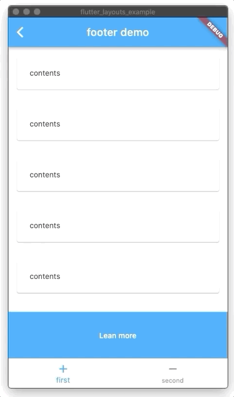

# flutter_layouts [](https://pub.dev/packages/flutter_layouts)


> Useful & production ready flutter layouts. not as examples, but as package. based on real-world apps


## Installation
```yaml
dependencies:
  flutter_layouts: latest
```


## Layouts List
- [sticky footer layout](/lib/src/footer) 


## Layouts Library
Layout             |  Preview
:-------------------------:|:-------------------------:
[footer](./lib/src/footer) |

